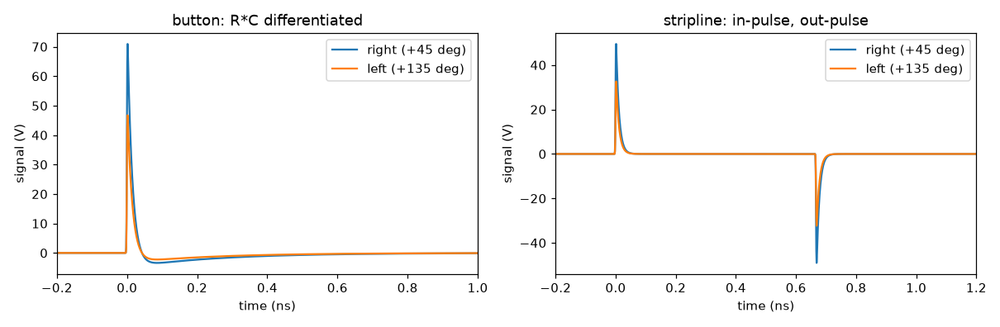

# Beam position monitors

Three models, in increasing order of what they cost and what they buy.

| Class | Models | Use it when |
| --- | --- | --- |
| [`BPM`](../api/bpm.md) | centroid plus charge-dependent noise | you want a plausible reading, fast |
| [`ButtonBPM`](../api/bpm.md) | per-electrode signal, R·C coupled | you care about waveforms or nonlinearity |
| [`StriplineBPM`](../api/bpm.md) | per-electrode signal, directional coupler | same, for a stripline pickup |

Everything after the electrodes — delay lines, hybrids, filters, amplifiers — is **not**
modelled here. It belongs in a SPICE netlist; see
[Signal conditioning in SPICE](spice.md).

## The readout model

```python
bpm = vd.BPM(resolution=10e-6, reference_charge=100e-12, offset=(30e-6, 0.0))
for charge in (250e-12, 100e-12, 20e-12, 5e-12):
    shots = [bpm.measure(beam.scaled_charge(charge), rng=s).x for s in range(400)]
    print(charge, np.mean(shots), np.std(shots), bpm.noise_at(charge))
```

```text
   charge     mean x      scatter    predicted
     250 pC    229.74 um      3.75 um      4.00 um
     100 pC    230.00 um      9.38 um     10.00 um
      20 pC    231.70 um     46.92 um     50.00 um
       5 pC    238.08 um    187.66 um    200.00 um
  true centroid_x = 199.57 um, electrical offset = 30.00 um
```

Resolution scales as `reference_charge / charge`, because the pickup signal is
proportional to charge while the amplifier noise is not. A BPM that is excellent at
250 pC can be useless at 1 pC, and that is the behaviour worth simulating. Below
`charge_threshold` the reading is `nan`, as the real thing reports and as your feedback
loop has to survive:

```python
bpm.measure(beam.scaled_charge(1e-15), rng=0)
# BpmReading(x=nan, y=nan, charge=1e-15)
```

## Per-electrode models

Both `ButtonBPM` and `StriplineBPM` inherit their geometry from
[`ElectrodePickup`](../api/bpm.md) and differ only in how an electrode responds.

### Where the current goes

For a beam at radius $r$, angle $\theta$, inside a pipe of radius $b$, the image current
density on the wall is the Poisson kernel

$$\frac{\mathrm{d}I}{\mathrm{d}\phi}
  = \frac{I_\mathrm{b}}{2\pi}\,
    \frac{b^2 - r^2}{b^2 + r^2 - 2br\cos(\phi-\theta)}$$

and each electrode intercepts its integral over its own angular width:

```python
for x0 in (0.0, 2e-3, 5e-3, 10e-3, 15e-3):
    print(vd.wall_current_fraction(x0, 0.0, 20e-3, vd.DIAGONAL_ELECTRODES, 0.5))
```

```text
   x (mm)     b1(+45)   b2(+135)  b3(+225)  b4(+315)     sum
      0.0  0.079577  0.079577  0.079577  0.079577  0.318310
      2.0  0.090598  0.068530  0.068530  0.090598  0.318256
      5.0  0.105221  0.052890  0.052890  0.105221  0.316222
     10.0  0.112281  0.030695  0.030695  0.112281  0.285951
     15.0  0.074615  0.013374  0.013374  0.074615  0.175979
```

A centred beam gives every electrode exactly $\Delta/2\pi = 0.0796$. As the beam moves
right the near electrodes gain and the far ones lose — but notice that past about 10 mm
the *near* electrodes start losing too, as the beam slides past their 45° position toward
the gap between them. That is where the linearity goes.

!!! note "Evaluating at the centroid is not an approximation"
    The Poisson kernel is harmonic inside the pipe, so its average over any circularly
    symmetric charge distribution equals its value at the centre. For a round beam,
    using the centroid is exact. A strongly elliptical beam close to the wall picks up a
    correction of order $(\sigma_x^2-\sigma_y^2)/b^2$, which this ignores.

### Position, and where it stops being linear

Position comes from projecting the electrode amplitudes onto the electrode angles,

$$x = b\,S\,\frac{\sum_i V_i \cos\phi_i}{\sum_i V_i},$$

which reduces to difference-over-sum for a symmetric layout and works for any
arrangement. `calibrate_sensitivity` fits the correction $S$ from pure geometry:

```python
bpm = vd.ButtonBPM(pipe_radius=20e-3)
bpm.sensitivity = bpm.calibrate_sensitivity()      # 1.017082
for x0 in (0.0, 1e-3, 3e-3, 6e-3, 10e-3, 14e-3):
    print(x0, bpm.position(bpm.measure(offset_beam(x0), rng=1))[0])
```

```text
   true (mm)  reported (mm)   error (um)
        0.00        -0.0001         -0.1
        1.00         1.0042          4.2
        3.00         2.9584        -41.6
        6.00         5.5808       -419.2
       10.00         8.2076      -1792.4
       14.00         9.7708      -4229.2
```

Micron-level near the axis, 7 % low at 6 mm, 30 % low at 14 mm. **This is the reason to
model electrodes individually** — a readout-level BPM is linear by construction and will
never show you this.

### Gain mismatch

Real electrodes differ by a few percent, and that mismatch appears directly as a position
offset on a perfectly centred beam:

```text
   button 1 gain 1.00 -> centred beam reads     0.72 um
   button 1 gain 1.02 -> centred beam reads    71.55 um
   button 1 gain 1.05 -> centred beam reads   176.98 um
```

A 2 % gain error on one electrode of a 20 mm pipe is a 70 µm apparent offset.

## Buttons

A button is a small capacitively coupled disc. Its response is the $R\,C$ high pass of
the electrode into its load, so a bunch produces a fast spike followed by an undershoot:

```python
bpm = vd.ButtonBPM(pipe_radius=20e-3)     # electrode droop_time = R*C = 250 ps
signals = bpm.measure(beam, rng=0)
signals.volts.shape                        # (4, 4000)
```



!!! warning "Sample inside the rise time"
    A one-pole response sampled at interval `dt` peaks at $Q/(\tau+dt)$ rather than
    $Q/\tau$, so an under-sampled electrode reports an amplitude that is too small.
    *Position* is unaffected — the error is common to every electrode and cancels in the
    ratio — but the absolute volts are not. Keep `electrode.sample_rate` about ten times
    inside the rise time.

## Striplines

A stripline is a length of transmission line matched at both ends. The bunch induces a
pulse as it enters and an equal, opposite one as it leaves, so the upstream port sees

$$V(t) = \tfrac{1}{2} Z_0 f_i \left[ I(t) - I(t-\tau) \right],
  \qquad \tau = \frac{L}{\beta c} + \frac{L}{c},$$

which is $2L/c$ for a relativistic beam. Three things follow, and all three are what
make a stripline a stripline.

**No DC response.** The two pulses have equal area whatever the bunch looks like:

```text
   max 46.794 V, min -46.345 V, separation 667.0 ps
   integral over the record: -4.737e-15 V.s  (a stripline has no DC response)
```

A stripline cannot measure charge. Use a transformer for that.

**A comb response.** $|H(f)| = 2|\sin(\pi f \tau)|$, peaking at the quarter-wave
frequency $c/4L$ and nulling at every multiple of $1/\tau$. Cutting the length is how you
put the peak where your electronics has gain:

```text
   L (mm)   round trip (ps)   f0 = c/4L (GHz)   first null (GHz)
       50            333.56             1.499              2.998
      100            667.13             0.749              1.499
      200           1334.26             0.375              0.749
```

```python
stripline.transfer_magnitude(frequency)    # 2 |sin(pi f tau)|
```

**Directivity.** A beam travelling the other way comes out of the other port. Set
`directivity` in dB and read the far port to see what leaks:

```text
   upstream/downstream = 19.96  (26 dB directivity -> 19.95)
```

!!! warning "Make the record long enough"
    The electrode's `duration` must comfortably exceed `round_trip_time()`, or the second
    pulse falls off the end of the record and the stripline silently looks like a button.
    This raises rather than fails quietly.

## Which readout

`amplitudes(signals, readout=...)` reduces each waveform to one number: `"peak"` as a
peak-detecting front end does, or `"integral"` for the area of the positive lobe, which
is quieter but needs a stable gate. For a stripline the full integral is zero, so only
the positive lobe carries anything.

Both give the same position to within a couple of percent — the difference is noise, not
bias.
