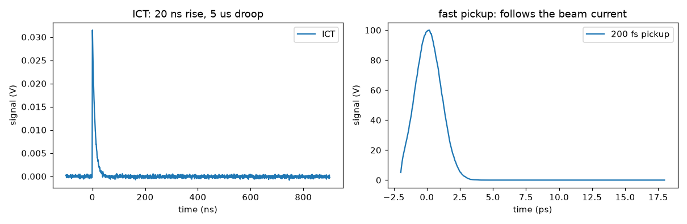

# Charge and current

One class, [`CurrentMonitor`](../api/electronic.md), covers integrating current
transformers, fast current transformers, wall current monitors and Faraday cups. They
differ in their impulse response and their calibration, not in their physics.

The response is a single-pole low pass (the rise time) followed by a single-pole high
pass (the droop) — the two numbers every transformer datasheet quotes.

## Rise time decides what you are measuring

```python
beam                      # sigma_t = 996 fs, peak beam current 100.1 A, 250 pC
for rise_time in (20e-9, 100e-12, 200e-15):
    monitor = vd.CurrentMonitor(rise_time=rise_time, droop_time=None, transimpedance=1.0, ...)
    t, v = monitor.measure(beam, rng=0)
    print(rise_time, v.max(), monitor.integrated_charge(t, v))
```

```text
  rise_time      tau      peak        integral
   20000.00 ps 9102.392 ps      0.03 A    250.00 pC
     100.00 ps   45.512 ps      5.14 A    250.00 pC
       0.20 ps    0.091 ps    100.64 A    244.22 pC
```

All three see the same 250 pC. What differs is the *shape*:

- **Rise time much longer than the bunch** (the 20 ns ICT, and the 100 ps FCT too — a
  1 ps bunch is short compared with both). The monitor integrates: the output is the
  impulse response scaled by charge, $\left(Q/\tau\right)e^{-t/\tau}$. Peak height is
  proportional to charge, and area is exactly $Q$.
- **Rise time shorter than the bunch** (200 fs). The output follows the instantaneous
  beam current, and the peak is the peak beam current — 100.6 A against a true 100.1 A.

An ICT and an FCT are the same object with different numbers in it.



## Droop makes an integrating monitor read low

A high pass removes DC, so the pulse is followed by an undershoot of equal area.
Integrating over a finite record therefore under-reads, and it under-reads more the
shorter the droop time:

```python
for droop in (1e-6, 5e-6, 20e-6, 100e-6, None):
    ict = vd.CurrentMonitor(rise_time=20e-9, droop_time=droop, transimpedance=1.25,
                            noise=0.0, sample_rate=2e9, duration=1e-6)
    t, v = ict.measure(beam, rng=0)
    print(droop, ict.integrated_charge(t, v))
```

```text
  droop_time    integral    error
        1 us     102.60 pC  -58.96 %
        5 us     209.20 pC  -16.32 %
       20 us     239.11 pC   -4.36 %
      100 us     247.78 pC   -0.89 %
        none     250.00 pC   -0.00 %
```

This is the real error that droop correction exists to fix on the hardware, and it is
worth knowing how large it is before you trust an integrated charge.

## Reading charge from pulse height

For an integrating monitor the peak is proportional to charge, so peak height is a valid
charge measurement — faster than integrating and immune to baseline drift, at the cost of
assuming the pulse shape never changes. This is the method used on the CLARA Faraday
cups:

```python
ict.peak_charge(volts, calibration=volts_per_coulomb)
```

!!! tip "A real front end, end to end"
    [A real front end: CLARA's charge AFE](front-end.md) drives a published charge
    front end with both a Faraday cup and a wall current monitor, and reproduces the
    amplitudes measured on the machine.

## The log-amp readout

CLARA's ICT IOCs report charge through a logarithmic amplifier, $Q = Q_\mathrm{Cal}
\cdot 10^{V/U_\mathrm{Cal}}$. [`LogAmpReadout`](../api/electronic.md) is that model and
its inverse:

```python
amp = vd.LogAmpReadout(qcal=1e-12, ucal=0.5)
for q in (1e-12, 10e-12, 100e-12, 250e-12, 1e-9):
    v = amp.voltage_from_charge(q)
    print(q, v, amp.charge_from_voltage(v))
```

```text
   charge     log-amp V    recovered
      1.0 pC    0.0000 V       1.000 pC
     10.0 pC    0.5000 V      10.000 pC
    100.0 pC    1.0000 V     100.000 pC
    250.0 pC    1.1990 V     250.000 pC
   1000.0 pC    1.5000 V    1000.000 pC
```

`ucal` is volts per decade of charge, so each factor of ten costs exactly 0.5 V here.
A beam-off reading gives `-inf`, and a negative charge gives `nan` — which is what a real
log amp does.

### Fitting the constants against a Faraday cup

Take the cup as truth, fit a straight line of $\log_{10} Q$ against the ICT voltage, and
the slope and intercept are your constants:

```python
slope, intercept = np.polyfit(volts, np.log10(cup_charge), 1)
fitted = vd.LogAmpReadout(qcal=10.0 ** intercept, ucal=1.0 / slope)
```

```text
  cup charge   ICT volts
      10.0 pC    0.4856 V
      50.0 pC    0.8225 V
     100.0 pC    0.9756 V
     250.0 pC    1.1644 V
     500.0 pC    1.3205 V
  fitted QCal = 1.0335 pC  (true 1.0500 pC)
  fitted UCal = 0.4904 V/decade  (true 0.4920)
  residuals (pC): [ 0.105 -0.844  0.88  -5.206  9.507]
```

Attach the fitted readout to the monitor and `measure_charge` gives you the scalar PV an
operator sees, carrying the log amp's calibration error rather than the waveform's noise:

```python
ict = vd.CurrentMonitor(..., readout=fitted)
ict.measure_charge(beam, rng=0)
```

## Digitising

Set `bits` and `full_scale` and `measure` returns integer ADC codes instead of volts.
Leave `bits=None` for the analogue waveform.

## Sampling

The waveform is binned at the digitiser sample rate. A bunch far shorter than one sample
lands in a single bin, which is the correct impulse for a monitor whose rise time is much
longer — the regime an ICT works in. If you want the *absolute* amplitude of a fast
pickup to be right, sample well inside its rise time: a one-pole response sampled at
interval `dt` peaks at $Q/(\tau + dt)$ rather than $Q/\tau$.
