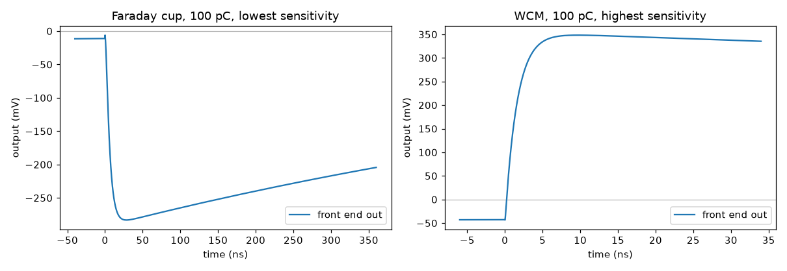
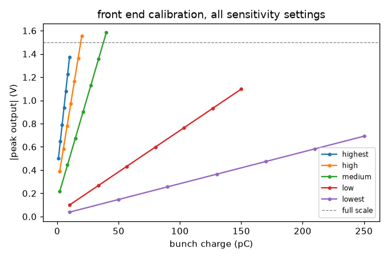

# A real front end: CLARA's charge AFE

The other guides use invented netlists. This one reproduces a published, built and
measured instrument:

> S. L. Mathisen, T. H. Pacey, R. J. Smith, **"Analog Front End for Measuring 1 to 250 pC
> Bunch Charge at CLARA"**, IBIC2022, MOP32.
> [doi:10.18429/JACoW-IBIC2022-MOP32](https://doi.org/10.18429/JACoW-IBIC2022-MOP32)

It is worth working through because it makes the package's central claim concrete: the
diagnostic and its electronics are separate problems. The same front end reads a Faraday
cup and a wall current monitor — two devices whose bandwidths differ by more than two
orders of magnitude — and the only thing that changes is a netlist parameter.

## The signal chain

```text
input --> 100 MHz RC low pass --> unity-gain FET buffer
      --> charge integrator (R_f || C_f, ADA4350) --> output buffer --> out
```

The 100 MHz input filter is the interesting part. Quoting the paper, it "enables the front
end to be agnostic about the bandwidth of the charge device it is connected to. The
bandwidth of an FC is controlled through the impedance it is discharged through, but a WCM
can have a bandwidth up to several GHz." The filter throws that difference away before the
integrator ever sees it.

`examples/netlists/clara_front_end.cir`:

```spice
*
*
*
*
*
*
.param CF=1n
.param RF=1k
.param GOUT=2.8
Vin in 0 PWL(0 0)
Rterm in 0 50
Rflt in flt 50
Cflt flt 0 31.83p
Ebuf buf 0 flt 0 1.0
Rbuf buf 0 1e9
Rs buf sj 50
Egm p1 0 0 sj 1e5
Rp p1 p2 1k
Cp p2 0 15.9n
Eoa oa 0 p2 0 1.0
Roa oa iout 10
Rfb sj iout {RF}
Cfb sj iout {CF}
Eob out 0 iout 0 {GOUT}
Rload out 0 1e6
.end
```

The input is driven with the pickup voltage developed across 50 Ω, so the charge arriving
at the summing node is the bunch charge and the integrator's peak is `-GOUT * Q / CF`.

### Sensitivity settings

Table 1 of the paper, with the feedback resistance and gain this model adds:

| Setting | `CF` | Range | `RF` | `GOUT` |
| --- | --- | --- | --- | --- |
| highest | 2 pF | 0–10 pC | 500 kΩ | 0.23 |
| high | 15 pF | 2–20 pC | 66.7 kΩ | 1.02 |
| medium | 51 pF | 2–40 pC | 19.6 kΩ | 1.90 |
| low | 300 pF | 10–150 pC | 3.33 kΩ | 2.20 |
| lowest | 1 nF | 10–250 pC | 1.00 kΩ | 2.80 |

!!! warning "What is from the paper, and what is not"
    **From the paper:** the 100 MHz input filter, the unity-gain FET input buffer, the
    ADA4350 charge integrator with switchable feedback, the five capacitances and ranges
    of Table 1, and the output polarities of Figs. 4 and 5.

    **Inferred.** `RF` is not given. Fig. 2 describes integration above 10 MHz, which would
    put `RF*CF` at about 16 ns — but the text states that bunch charge is proportional to
    the *peak* of the output, which only holds when `RF*CF` is much longer than the bunch,
    and Figs. 4–6 show microsecond-wide pulses. `RF` is therefore set for `RF*CF = 1 µs`.
    If you have the schematic, this is the number to correct.

    **Fitted.** `GOUT` is not given either, and the per-setting gains in Fig. 3 are not a
    common factor, so each path needs its own. These are fitted to the saturation points
    of Fig. 3. Treat both as calibration knobs, not datasheet values.

## Two devices, one front end

```python
faraday_cup = vd.CurrentMonitor(
    rise_time=11e-9, droop_time=None,       # DC coupled; ~32 MHz from its discharge path
    transimpedance=50.0, sample_rate=2e10, duration=400e-9,
)

WCM_LOW, WCM_HIGH = 100e3, 6e9
wall_current_monitor = vd.CurrentMonitor(
    rise_time=np.log(9.0) / (2 * np.pi * WCM_HIGH),   # 58.3 ps
    droop_time=1.0 / (2 * np.pi * WCM_LOW),           # 1.592 us
    transimpedance=-2.0,                              # image current, few-ohm transfer Z
    sample_rate=1e11, duration=40e-9,
)
```

Two things separate the WCM from the cup, and both come straight out of the model:

**Polarity.** A WCM measures the beam's *image* current, so its transfer impedance enters
with the opposite sign and the front end's output flips — even though nothing in the front
end changed. The paper sees exactly this: negative in Fig. 4, positive in Fig. 5.

**Signal size.** A cup collects the charge and discharges it through 50 Ω, so the whole
bunch charge reaches the integrator. A WCM has a transfer impedance of a few ohms, so only
a fraction `Zt/50` arrives. That is why the paper takes all its WCM data on the *highest*
sensitivity setting, "due to the very low signal developed by the WCM".

## Running it

```bash
python examples/clara_front_end.py
```

```text
ngspice: ngspice-42 : Circuit level simulation program

charge devices
  Faraday cup   DC coupled,    31.79 MHz, rise 11.0 ns, 50 ohm
  WCM           100 kHz - 6.00 GHz, rise 58.3 ps, droop 1.592 us, 2 ohm

100 pC, on the setting the paper used for each device
  Faraday cup  lowest   pickup peak    0.984 V   charge to integrator  100.01 pC   out  -283.21 mV   (paper: -300 mV)
  WCM          highest  pickup peak   -4.727 V   charge to integrator   -3.92 pC   out   348.28 mV   (paper: +400 mV)
  polarity flips for the WCM because it sees the image current

calibration curves (peak output vs charge), Faraday cup
  setting         CF        range      V/pC   linearity
  highest         2p      0-10 pC    96.54m     0.028%
  high           15p      2-20 pC    64.79m     0.013%
  medium         51p      2-40 pC    36.03m     0.010%
  low           300p    10-150 pC     7.13m     0.001%
  lowest       1000p    10-250 pC     2.72m     0.001%
  each setting spans most of the 1.5 V full scale over its range

the 100 kHz corner, over an 8 us record
  bunch pulse        -4987.680 mV, area -4927.416 pV.s
  droop tail             3.134 mV, area 4949.658 pV.s
  areas cancel to      0.4514 % -- the high pass removes DC exactly
  fitted tail decay    1.5918 us  (1/2*pi*100kHz = 1.5915 us)

figures written to docs/images/
```



The cup lands at **−283 mV** against a reported −300 mV, and that number is not fitted:
a cup discharges its whole charge through 50 Ω, so it follows from Table 1's capacitance
and the gain fitted to Fig. 3. The WCM gives **+348 mV** against a reported +400 mV, about
13 % low. Its transfer impedance is the one genuinely free parameter here and it is left
at a round 2 Ω rather than tuned to close the gap — a typical value for a WCM, and
tightening it to match a digit read off a figure would be false precision.



Compare with Fig. 3 of the paper: nested straight lines, each setting steeper than the
last and each spanning most of full scale over its own Table 1 range. Linearity is better
than 0.03 % across all five, which is the front end doing its job rather than a triumph of
modelling — the integrator is linear by construction.

## The 100 kHz corner

The upper corner of the WCM's bandpass sets its rise time, and that is easy to see. The
lower corner is subtler: a high pass removes DC, so the bunch pulse is followed by a tail
of opposite sign carrying exactly equal area, decaying with `1/(2*pi*f_low)`.

Both fall out of the waveform:

```text
  bunch pulse        -4987.680 mV, area -4927.416 pV.s
  droop tail             3.134 mV, area 4949.658 pV.s
  areas cancel to      0.4514 % -- the high pass removes DC exactly
  fitted tail decay    1.5918 us  (1/2*pi*100kHz = 1.5915 us)
```

Fitting the tail's decay recovers 1.5918 µs against the 1.5915 µs the 100 kHz corner
implies — four significant figures, from a waveform rather than from the parameter that
generated it. The areas cancelling to 0.45 % is the same statement in the time domain:
whatever the bunch looks like, a 100 kHz-coupled monitor returns no net charge.

This is why a WCM cannot measure charge on its own over a long gate, and why the front end
integrates a short window around the bunch instead. It is also the mechanism behind Fig. 6
of the paper, where dark current and bunch charge are separated by their bandwidth.

## What this does not model

The op-amp is a single-pole model with no supply rails, so nothing clips — the calibration curves run straight through full scale instead of bending
over as Fig. 3 does. There is no charge injection circuit, no input switch, no digital
control, and no noise from the front end itself beyond what the monitor contributes. The
ADA4350's real feedback network has six paths, not five, the last one non-integrating.

The amplifier is also given about 10 GHz of gain-bandwidth, which is generous for a real
part. That is deliberate: the loop bandwidth of a transimpedance stage is roughly
`GBW/(Zf/Rs)`, and on the 2 pF setting a 1 GHz amplifier runs out of it and fails to
capture the whole bunch charge — the measured sensitivity came out 16 % low before the
model's amplifier was taken out of the way. Real hardware has the 100 MHz input filter
stretching the pulse first, which buys back most of that margin.
