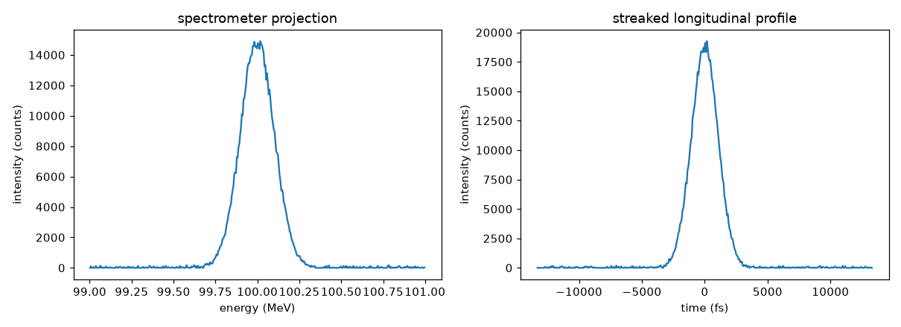
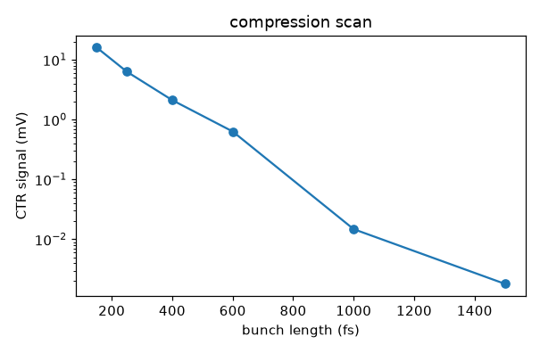

# Energy and bunch length

[`Spectrometer`](../api/screen.md) and [`StreakedScreen`](../api/screen.md) contain **no
new physics**. The dipole and the transverse deflecting cavity are your tracking code's
job. Track the beam to the screen, then use these to turn pixel positions into energy or
time.

## Energy: dipole, then a screen

Track through your dipole in Cheetah, put a screen after it, and tell the spectrometer
the dispersion:

```python
spectrometer = vd.Spectrometer(
    screen=vd.Screen(pixel_size=20e-6, resolution=(400, 200), counts_per_pc=3e3),
    dispersion=0.4,                    # metres: x = eta * delta
    reference_energy=beam.mean_energy,
)
image = spectrometer.measure(dispersed_beam, rng=0)
print(spectrometer.mean_energy(image))
print(spectrometer.energy_spread(image, beam_size=beam.sigma_x))
```

```text
  mean energy      100.000 MeV
  energy spread      99.97 keV  (measured)
  true spread       100.00 keV
```

!!! warning "Subtract the betatron size or you have an upper limit"
    The measured width contains the beam size at the screen as well as the energy spread.
    Pass it as `beam_size` — get it from a zero-dispersion measurement, or from your
    optics. Leave it at zero and the number you get back is an upper limit, not the
    energy spread.

`spectrum(image)` gives you the calibrated projection, sorted into increasing energy even
when the dispersion is negative:

```python
energy, intensity = spectrometer.spectrum(image)
```

## Bunch length: deflecting cavity, then a screen

The deflector maps arrival time onto transverse position with a shear $S$ in metres per
second. For a cavity of voltage $V$ at RF wavenumber $k$,

$$S = \frac{c\,k\,V\sqrt{\beta\beta_s}\,\sin\Delta\phi}{E}.$$

```python
tds = vd.StreakedScreen(
    screen=vd.Screen(pixel_size=20e-6, resolution=(200, 400), counts_per_pc=3e3),
    shear=3e8,                         # m/s: y = S * t
)
image = tds.measure(streaked_beam, rng=0)
print(tds.bunch_length(image, unstreaked_size=beam.sigma_y))
```

```text
  bunch length      999.21 fs  (measured)
  true length      1000.69 fs
  pixel limit        66.67 fs
```



The resolution limit is the unstreaked beam size divided by the shear,
$\sigma_t^{\min} = \sigma_\perp / S$. Measure $\sigma_\perp$ with the deflector off and
pass it as `unstreaked_size`; it is removed in quadrature along with the PSF and the
pixel pitch. `tds.resolution` gives the pixel-pitch floor, which is almost never the
real limit.

`profile(image)` returns the time-calibrated longitudinal profile.

## Compression: coherent radiation

[`CoherentRadiationMonitor`](../api/electronic.md) is not a bunch length measurement. It
is the compression tuning signal every linac optimiser actually uses. Coherent emission
scales as $N^2|F(f)|^2$, where $F$ is the normalised Fourier transform of the
longitudinal profile, so a detector watching a fixed band gives a signal that rises
steeply as the bunch shortens:

```python
crm = vd.CoherentRadiationMonitor(band=(0.3e12, 3e12), calibration=1e18)
for sigma_t in (1500e-15, 1000e-15, 600e-15, 400e-15, 250e-15, 150e-15):
    print(sigma_t, crm.measure(compressed(sigma_t), rng=0))
```

```text
  sigma_t   1500 fs ->     0.0017 mV
  sigma_t   1000 fs ->     0.0137 mV
  sigma_t    600 fs ->     0.6299 mV
  sigma_t    400 fs ->     2.1437 mV
  sigma_t    250 fs ->     6.4140 mV
  sigma_t    150 fs ->    16.0745 mV
```



Four orders of magnitude across a factor of ten in bunch length. That steepness is what
makes it a good optimiser signal and a bad absolute measurement.

`form_factor(beam)` gives $|F(f)|^2$ directly, and for a Gaussian it matches
$\exp[-(2\pi f\sigma_t)^2]$:

```text
  sigma_t=   300 fs: |F(0)|^2=1.0000  |F(0.5 THz)|^2=4.1581e-01 (analytic 4.1640e-01)
```

!!! warning "The macroparticle count sets a floor"
    The profile is a histogram, so the form factor cannot be trusted below roughly
    $1/N$. Deep in the tail this matters:

    ```text
      N=   100000  1/N=1.00e-05  |F(0.5 THz)|^2=7.5172e-05  analytic=5.2199e-05
      N=  1000000  1/N=1.00e-06  |F(0.5 THz)|^2=4.8190e-05  analytic=5.3453e-05
    ```

    Ten times the macroparticles brings a 44 % error down to 10 %. If your detector band
    sits where $|F|^2$ is very small, you need a lot of particles.

The single-particle emission spectrum is taken as flat across the band, and diffraction,
detector response and transport optics are all folded into `calibration`. That gives the
right *scaling* with bunch length, which is what a compression scan needs. It is not an
absolute radiated power.
