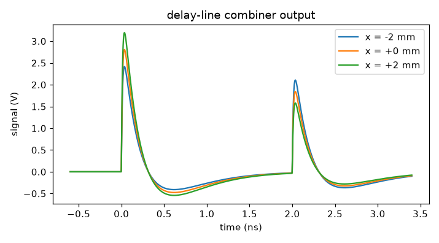

# Signal conditioning in SPICE

Raw diagnostic devices in this package produce electrode-level signals and stop there.
Everything after that — terminations, delay lines, hybrids, filters, amplifiers,
limiters — lives in a SPICE netlist, where you have already designed it.
[`SpiceFrontEnd`](../api/spice.md) drives that netlist with the diagnostic's signals and
hands back the conditioned result.

There are two ways to get a signal into SPICE, and you want the first one unless you have
a reason not to.

## Run the netlist from Python

```python
front_end = vd.SpiceFrontEnd(
    netlist="frontend.cir",     # text, or a path to a .cir file
    sources="Vin",              # the placeholder source to drive
    outputs="out",              # the node to read back
)
t_out, v_out = front_end.run(t, volts)
```

The netlist needs a placeholder source at the point where the signal enters, and any
`.tran` line is rewritten to match your record:

```spice
* 50 ohm source into an RC low pass
Vin inp 0 PWL(0 0)
R1 inp out 50
C1 out 0 20p
Rload out 0 1e6
.end
```

`build(t, v)` returns exactly the netlist that will be handed to ngspice, decimation
included — the first thing to look at when a simulation misbehaves.

## Many sources, one simulation

All sources are driven in a **single** run, so the netlist is free to combine them. That
is what makes a delay-line combiner work:

```python
combiner = vd.SpiceFrontEnd(
    netlist="examples/netlists/delay_line_combiner.cir",
    sources=("Vb1", "Vb2", "Vb3", "Vb4"),
    outputs="xout",
)
signals = bpm.measure(beam, rng=0)
t_out, trace = combiner.run(signals.t, signals.volts)
```

`ElectrodeSignals.volts` is already shaped `(n_electrodes, n_samples)`, so it goes
straight in. You can also pass a dict keyed by source name. Ask for several `outputs`
and you get a dict back instead of an array.

## Worked example: a delay-line combiner

Each opposing pair of buttons is joined by a length of cable and read out at one end. The
near button appears immediately; the far button arrives one line delay later. One
digitiser channel then carries both, and the difference in peak height is proportional to
position.

```spice
* --- horizontal pair: right (1,4) read directly, left (2,3) delayed ---
Vb1 b1 0 PWL(0 0)
Vb2 b2 0 PWL(0 0)
Vb3 b3 0 PWL(0 0)
Vb4 b4 0 PWL(0 0)

* passive sum of the two buttons on each side, into 50 ohm
Rb1 b1 right 100
Rb4 b4 right 100
Rb2 b2 left  100
Rb3 b3 left  100
Rright right 0 50
Rleft  left  0 50

* the delay line joins the two sides; we tap the right-hand end
Tdelay right 0 left 0 Z0=50 TD=2n
Rsum right sumx 50

* front-end shaping: band limit, then a x4 stage
Rf sumx filt 25
Cf filt 0 4p
Eamp xout 0 filt 0 4
Rload xout 0 1e6
.end
```

Sweeping the beam across the aperture:

```text
    x (mm)   direct (V)  delayed (V)   difference/sum
     -2.00       2.4171       2.1062         0.068735
     -1.00       2.6109       1.9760         0.138414
      0.00       2.8068       1.8434         0.207183
      1.00       3.0027       1.7108         0.274078
      2.00       3.1955       1.5798         0.338346
  calibration: x = 14.813 mm * (d/s) + -3042.0 um
  geometric expectation b/sqrt(2) = 14.142 mm
```



The fitted slope, 14.81 mm per unit difference-over-sum, is within 5 % of the geometric
$b/\sqrt{2} = 14.14$ mm. The large **offset** is real and instructive: only one branch
goes through the delay line, so the two peaks are attenuated differently and a centred
beam does not give a zero ratio. On the hardware you calibrate that out; here you can see
exactly how big it is before you build anything.

`T` is ngspice's lossless transmission line — `Tname n1+ n1- n2+ n2- Z0=... TD=...` —
which is the natural way to write a delay line. Use `LTRA` if you need loss and
dispersion.

## Export a waveform instead

If you would rather drive the simulation yourself, in LTspice or a batch ngspice run,
write a piecewise-linear source file:

```python
vd.to_spice_pwl("ict.pwl", t, v)
```

```spice
V1 pickup 0 PWL FILE=ict.pwl
R1 pickup 0 50
.tran 10p 200n
```

```text
0.000000000e+00	2.057713748e-04
5.000000000e-10	3.283840081e-04
1.000000000e-09	2.293439059e-04
```

The record is shifted to start at `t = 0` by default. A SPICE transient analysis starts
at zero and silently discards everything before it, and beam time axes are centred on the
bunch and run negative — which would eat the front of your pulse. `SpiceFrontEnd` does
the same shift internally and shifts back on the way out, so the times you get back line
up with the times you passed in.

## Getting ngspice working

```bash
pip install -e ".[spice]"        # PySpice
sudo apt install libngspice0     # the shared library
python -c "import virtual_diagnostics as vd; print(vd.ngspice_available())"
```

Two wrinkles are handled for you, both verified against ngspice 42 and PySpice 1.5:

- **The library name.** PySpice looks for `libngspice.so`, but distributions ship
  `libngspice.so.0` and only provide the unversioned symlink in the `-dev` package.
  `ngspice_library_path()` finds the versioned file and points PySpice at it through
  `NGSPICE_LIBRARY_PATH`. Set that variable yourself to override.
- **A benign banner treated as an error.** PySpice 1.5 treats any ngspice stderr message
  that does not begin with `Warning:` as a failure, and ngspice 42 prints
  `Using SPARSE 1.3 as Direct Linear Solver` there on every run. The simulation
  succeeds; only the wrapper thinks otherwise. This module decides success by whether the
  run actually produced data, and surfaces the real stderr if it did not.

You may still see `Note: can't find the initialization file spinit.` and
`Unsupported Ngspice version 42` printed by the C library. Both are harmless.

If ngspice is missing, `ngspice_available()` returns `False` and nothing else in the
package is affected — the SPICE path is entirely optional.

## Limits

- The record is **not** extended for you. If the netlist delays a signal by more than the
  record length, that pulse never arrives. Make the diagnostic's `duration` long enough,
  or set `end_time` explicitly.
- Inlined PWL points are decimated to `max_points` (4000 by default). Raise it for a
  sharp edge that matters; ngspice slows down noticeably past a few thousand.
- Results come back interpolated onto your input time axis. Pass `resample=False` to see
  the solver's own adaptive grid.
