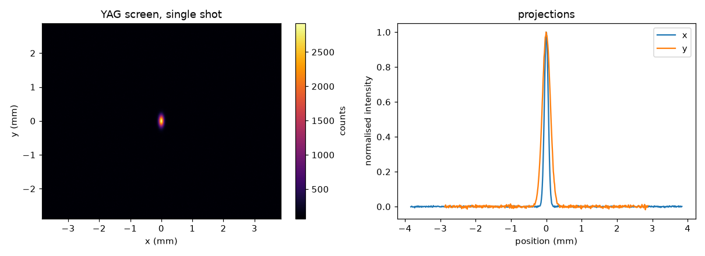

# virtual_diagnostics

Simulation stops at the beam. The control system starts at the signal. Nobody owns the gap.

This package owns the gap. Give it a cloud of macroparticles in 6D phase space and it gives you
what the instrument would actually have produced: a noisy 12-bit camera frame, a
bandwidth-limited pickup waveform that droops, a BPM reading that falls apart at low charge.

## What it is for

- **Validating analysis code.** You know the true beam size, so you can find out what your
  image-fitting routine reports when the screen saturates or the beam is smaller than the PSF.
- **Training and testing tuning agents.** Optimisers and ML controllers need realistic signals,
  including the ones that go wrong.
- **Designing front-end electronics.** Export a synthetic pickup waveform and drive your own
  SPICE netlist with it, before the hardware exists.

## Install

```bash
pip install -e ".[cheetah,hdf5,docs,dev]"
```

The core needs only NumPy, SciPy and Matplotlib. The `cheetah` extra pulls in
[Cheetah](https://github.com/desy-ml/cheetah) (and therefore torch) and is only needed for the
Cheetah adapter — any other tracking code plugs in through
[`from_arrays`](guides/other-codes.md) with no extra dependencies at all.

## Sixty seconds

```python
import numpy as np
import virtual_diagnostics as vd

rng = np.random.default_rng(0)
n = 100_000
beam = vd.Beam(
    x=rng.normal(0, 150e-6, n), y=rng.normal(0, 80e-6, n),
    t=rng.normal(0, 1e-12, n),
    px=np.zeros(n), py=np.zeros(n), pz=np.full(n, 100e6),
    q=np.full(n, 250e-12 / n), energy=100e6,
)
print(beam)

screen = vd.Screen(pixel_size=10e-6, resolution=(400, 300), psf_sigma=25e-6, counts_per_pc=1e4)
image = screen.measure(beam, rng=0)

print("frame:", image.counts.shape, image.counts.dtype, "peak", image.counts.max())
print("raw sigma_x/y (um):", tuple(round(v * 1e6, 2) for v in image.beam_size(deconvolved=False)))
print("deconvolved (um): ", tuple(round(v * 1e6, 2) for v in image.beam_size()))
print("true (um):        ", (round(beam.sigma_x * 1e6, 2), round(beam.sigma_y * 1e6, 2)))
```

```text
Beam(n=100000, charge=250 pC, energy=100 MeV, species='electron', sigma_x=150 um, sigma_y=80.2 um, sigma_t=1e+03 fs)
frame: (300, 400) uint16 peak 3280
raw sigma_x/y (um): (152.17, 83.85)
deconvolved (um):  (150.08, 79.99)
true (um):         (150.02, 80.18)
```

The raw widths read high because the 25 µm point spread adds in quadrature; deconvolving it
recovers the true beam size. That gap between *what the screen shows* and *what the beam is* is
the entire point of the package.

## Starting from Cheetah

```python
import cheetah, torch
import virtual_diagnostics as vd

source = cheetah.ParticleBeam.from_twiss(
    num_particles=200_000,
    beta_x=torch.tensor(5.0), beta_y=torch.tensor(5.0),
    emittance_x=torch.tensor(1e-9), emittance_y=torch.tensor(1e-9),
    energy=torch.tensor(100e6),
    sigma_tau=torch.tensor(0.3e-3), sigma_p=torch.tensor(1e-3),
    total_charge=torch.tensor(250e-12),
)
lattice = cheetah.Segment([
    cheetah.Drift(length=torch.tensor(0.5)),
    cheetah.Quadrupole(length=torch.tensor(0.1), k1=torch.tensor(3.0)),
    cheetah.Drift(length=torch.tensor(1.5)),
])

beam = vd.from_cheetah(lattice.track(source))
```

`examples/clara_diagnostics.py` runs that beam through every diagnostic in the package and
writes the figures used in these pages. Its full output:

```text
beam at the screen:
  Beam(n=200000, charge=250 pC, energy=100 MeV, species='electron', sigma_x=46.1 um, sigma_y=109 um, sigma_t=1e+03 fs)
  charge            250.00 pC
  energy            100.00 MeV
  energy spread      0.100 %
  sigma_x            46.09 um
  sigma_y           108.97 um
  sigma_t          1000.69 fs

screen (YAG, 12 um pixels, 30 um PSF):
  frame           640 x 480 px, 12-bit
  peak            2849 counts
  off screen         0.000 %
  saturated          0.000 % of pixels
  measured sigma     54.70 /   112.56 um  (raw)
  measured sigma     45.61 /   108.44 um  (deconvolved)
  true sigma         46.09 /   108.97 um

current monitors:
  ICT peak          31.499 mV
  ICT integral      206.25 pC  (droop under-reads)
  ICT bandwidth      17.48 MHz
  FCT peak            5.14 A   (100 ps rise: still integrating)
  FCT integral      250.00 pC
  fast peak          99.27 A   (200 fs rise: follows the current)
  peak current       99.67 A   (true)
  true charge       250.00 pC
  wrote examples/ict_pulse.pwl for SPICE

BPM, readout model (10 um resolution at 100 pC, 30 um electrical offset):
   charge     reading x     scatter    predicted
     250 pC     29.80 um      3.89 um      4.00 um
      50 pC     29.02 um     19.44 um     20.00 um
       5 pC     20.20 um    194.35 um    200.00 um

per-electrode models:
  button electrode R*C        250.0 ps
  stripline round trip        667.1 ps  (2L/c)
  stripline peak response     0.749 GHz  (c/4L)
    x (mm)   button reads   stripline reads
      0.00        -0.0000            0.0000
      1.00         1.0042            1.0042
      3.00         2.9585            2.9586
      6.00         5.5808            5.5808
     12.00         9.1156            9.1157
  (both read low near the wall: the Poisson kernel, not a bug)

delay-line combiner (the delay line lives in the netlist):
    x (mm)   direct (V)  delayed (V)   difference/sum
     -2.00       2.4171       2.1062         0.068735
     -1.00       2.6109       1.9760         0.138414
      0.00       2.8068       1.8434         0.207183
      1.00       3.0027       1.7108         0.274078
      2.00       3.1955       1.5798         0.338346
  calibration: x = 14.813 mm * (d/s) + -3042.0 um
  geometric expectation b/sqrt(2) = 14.142 mm
  the offset is the branch asymmetry -- one side goes through the line

spectrometer (0.4 m dispersion):
  mean energy      100.000 MeV
  energy spread      99.97 keV  (measured)
  true spread       100.00 keV

transverse deflector (3.0e+08 m/s shear):
  bunch length      999.21 fs  (measured)
  true length      1000.69 fs
  pixel limit        66.67 fs

CTR monitor (0.3-3 THz band):
  sigma_t   1500 fs ->     0.0017 mV
  sigma_t   1000 fs ->     0.0137 mV
  sigma_t    600 fs ->     0.6299 mV
  sigma_t    400 fs ->     2.1437 mV
  sigma_t    250 fs ->     6.4140 mV
  sigma_t    150 fs ->    16.0745 mV

figures written to docs/images/
```



## What is here

| Instrument | Class | Output |
| --- | --- | --- |
| Scintillator / OTR screen | [`Screen`](api/screen.md) | 12- or 16-bit camera frame |
| Dispersive screen | [`Spectrometer`](api/screen.md) | energy spectrum |
| Screen after a deflecting cavity | [`StreakedScreen`](api/screen.md) | longitudinal profile |
| ICT, FCT, WCM, Faraday cup | [`CurrentMonitor`](api/electronic.md) | time-domain waveform, charge |
| Log-amp charge readout | [`LogAmpReadout`](api/electronic.md) | scalar PV |
| BPM, readout level | [`BPM`](api/bpm.md) | x, y, charge |
| Button BPM | [`ButtonBPM`](api/bpm.md) | one waveform per electrode |
| Stripline BPM | [`StriplineBPM`](api/bpm.md) | one waveform per electrode |
| CTR / CDR compression monitor | [`CoherentRadiationMonitor`](api/electronic.md) | scalar volts |
| Your signal conditioning | [`SpiceFrontEnd`](api/spice.md) | whatever your netlist does |


Everything after the electrodes --- delay lines, hybrids, filters, amplifiers --- is
deliberately *not* a Python class. It goes in a SPICE netlist, where you have already
designed it, and [`SpiceFrontEnd`](guides/spice.md) drives that netlist with the
diagnostic's signals.

## What is deliberately not here

No adapter framework for tracking codes, no plugin registry, no diagnostic base class. The
[`Beam`](concepts.md) is a documented struct of NumPy arrays; if your code can produce seven
arrays it can drive everything here. See [Physics and assumptions](physics.md) for the models
behind each instrument and the effects they knowingly leave out.
